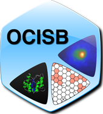

.. Bacteria Rotation Analysis Software documentation master file, created by
   sphinx-quickstart on Sun Nov 21 12:11:45 2010.
   You can adapt this file completely to your liking, but it should at least
   contain the root `toctree` directive.

Welcome to Bacteria Rotation Analysis Software's documentation!
===============================================================

Contents:

.. toctree::
   :maxdepth: 2

   intro
   documentation
   download
   licence

These programs have been designed within a project carried out in the
`Oxford Centre for Integrative Systems Biology
<http://www.sysbio.ox.ac.uk/>`_ (`University of Oxford
<http://www.ox.ac.uk/>`_)

.. Indices and tables
.. ==================

.. * :ref:`genindex`
.. * :ref:`modindex`
.. * :ref:`search`

